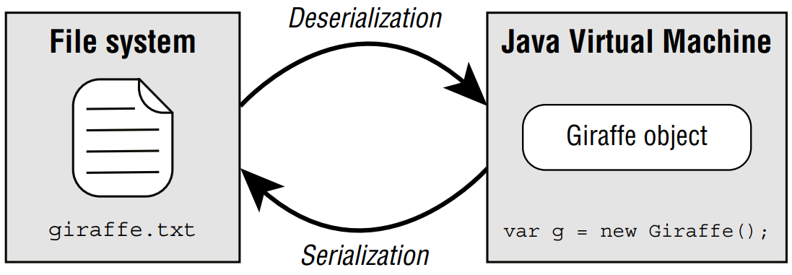

# Serializing Data

Throughout this book, we have been managing our data model using classes, so it makes
sense that we would want to save these objects between program executions. Data about
our zoo animals’ health wouldn’t be particularly useful if it had to be entered every time the
program runs! <br />

&emsp;&emsp;
You can certainly use the I/O stream classes you’ve learned about so far to store text and
binary data, but you still have to figure out how to put the data in the I/O stream and then
decode it later. There are various file formats like XML and CSV you can standardize to, but
you often have to build the translation yourself. <br />

&emsp;&emsp;
Alternatively, we can use serialization to solve the problem of how to convert objects
to/from an I/O stream. _Serialization_ is the process of converting an in-memory object to a
byte stream. Likewise, _deserialization_ is the process of converting from a byte stream into
an object. Serialization often involves writing an object to a stored or transmittable format,
while deserialization is the reciprocal process. <br />

&emsp;&emsp;
Figure 14.6 shows a visual representation of serializing and deserializing a Giraffe
object to and from a giraffe.txt file.

> **Figure 14.6** Serialization process



&emsp;&emsp;
In this section, we show you how Java provides built-in mechanisms for serializing and
deserializing I/O streams of objects directly to and from disk, respectively.

## I. Applying the _Serializable_ Interface
To serialize an object using the I/O API, the object must implement the
**java.io.Serializable** interface. The **Serializable** interface is a marker interface,
which means it does not have any methods. Any class can implement the **Serializable**
interface since there are no required methods to implement.

> #### Note
> Since **Serializable** is a marker interface with no **abstract** members,
why not just apply it to every class? Generally speaking, you should only
mark data-oriented classes serializable. Process-oriented classes, such
as the I/O streams discussed in this chapter or the **Thread** instances you
learned about in Chapter 13, are often poor candidates for serialization,
as the internal state of those classes tends to be ephemeral or short-lived.

&emsp;&emsp;
The purpose of using the **Serializable** interface is to inform any process attempting to
serialize the object that you have taken the proper steps to make the object serializable. All
Java primitives and many of the built-in Java classes that you have worked with throughout
this book are **Serializable**. For example, this class can be serialized:

```java
import java.io.Serializable;
public class Gorilla implements Serializable {
    private static final long serialVersionUID = 1L;
    private String name;
    private int age;
    private Boolean friendly;
    private transient String favoriteFood;
    
    // Constructors/Getters/Setters/toString() omitted
}
```

&emsp;&emsp;
In this example, the **Gorilla** class contains three instance members (**name**, **age**,
**friendly**) that will be saved to an I/O stream if the class is serialized. Note that since
**Serializable** is not part of the **java.lang package**, it must be imported or referenced
with the package name. <br />

&emsp;&emsp;
What about the **favoriteFood** field that is marked **transient**? Any field that is
marked **transient** will not be saved to an I/O stream when the class is serialized. We 
discuss that in more detail next.

> ### Real World Scenario
> #### Maintaining a _serialVersionUID_
> It’s a good practice to declare a **static serialVersionUID** variable in every class that
implements **Serializable**. The version is stored with each object as part of serialization.
Then, every time the class structure changes, this value is updated or incremented. 
> 
> Perhaps our **Gorilla** class receives a new instance member **Double** banana, or maybe
the age field is renamed. The idea is a class could have been serialized with an older 
version of the class and deserialized with a newer version of the class. 
> 
> The **serialVersionUID** helps inform the JVM that the stored data may not match the
new class definition. If an older version of the class is encountered during deserialization,
a **java.io.InvalidClassException** may be thrown. Alternatively, some APIs support
converting data between versions.

## II. Marking Data _transient_
The **transient** modifier can be used for sensitive data of the class, like a **password**. There
are other objects it does not make sense to serialize, like the state of an in-memory **Thread**.
If the object is part of a serializable object, we just mark it **transient** to ignore these select
instance members. <br />

&emsp;&emsp;
What happens to data marked **transient** on deserialization? It reverts to its default Java
values, such as **0.0** for **double**, or **null** for an **object**. You see examples of this shortly when we
present the object stream classes.

> #### Note
> Marking **static** fields transient has little effect on serialization. Other
than the **serialVersionUID**, only the instance members of a class are
serialized.

## III. Ensuring That a Class Is Serializable
Since **Serializable** is a marker interface, you might think there are no rules to using it. Not
quite! Any process attempting to serialize an object will throw a **NotSerializableException** if
the class does not implement the **Serializable** interface properly. <br />

**How to Make a Class Serializable**
- The class must be marked **Serializable**.
- Every instance member of the class must be serializable, marked **transient**, or have a
  **null** value at the time of serialization.

&emsp;&emsp;
Be careful with the second rule. For a class to be serializable, we must apply the second
rule recursively. Do you see why the following **Cat** class is not serializable?

```java
public class Cat implements Serializable {
    private Tail tail = new Tail();
}

public class Tail implements Serializable {
    private Fur fur = new Fur();
}

public class Fur {}
```

&emsp;&emsp;
**Cat** contains an instance of **Tail**, and both of those classes are marked **Serializable**,
so no problems there. Unfortunately, **Tail** contains an instance of **Fur** that is not marked
**Serializable**. <br />

&emsp;&emsp;
Either of the following changes fixes the problem and allows **Cat** to be serialized:

```java
public class Tail implements Serializable {
    private transient Fur fur = new Fur();
}

public class Fur implements Serializable {}
```

&emsp;&emsp;
We could also make our **tail** or **fur** instance members **null**, although this would make
**Cat** serializable only for particular instances, rather than all instances.

> #### Serializing Records
> 
> Do you think this record is serializable?
> ```
>   record Record(String name) {}
> ```
> 
> t is not serializable because it does not implement **Serializable**. A record follows the
same rules as other types of classes with respect to whether it can be serialized. Therefore,
this one can be:
> ```
>   record Record(String name) implements Serializable {}
> ```

## IV. Storing Data with _ObjectOutputStream_ and _ObjectInputStream_
The **ObjectInputStream** class is used to deserialize an object, while the
**ObjectOutputStream** is used to serialize an object. They are high-level streams that
operate on existing I/O streams. While both of these classes contain a number of methods for
built-in data types like primitives, the two methods you need to know for the exam are the
ones related to working with objects.

```java
// ObjectInputStream
public Object readObject() throws IOException, ClassNotFoundException
    
// ObjectOutputStream
public void writeObject(Object obj) throws IOException
```

&emsp;&emsp;
Note the parameters, return types, and exceptions thrown. We now provide a sample
method that serializes a **List** of **Gorilla** objects to a file:

```java
void saveToFile(List<Gorilla> gorillas, File dataFile)
    throws IOException {
    try (var out = new ObjectOutputStream(
            new BufferedOutputStream(
                    new FileOutputStream(dataFile)))) {
        for (Gorilla gorilla : gorillas)
            out.writeObject(gorilla);
    }
}
```

&emsp;&emsp;
Pretty easy, right? Notice that we start with a file stream, wrap it in a buffered I/O stream
to improve performance, and then wrap that with an object stream. Serializing the data is as
simple as passing it to` writeObject()`. <br />

&emsp;&emsp;
Once the data is stored in a file, we can deserialize it by using the following method:

```java
List<Gorilla> readFromFile(File dataFile) throws IOException,
        ClassNotFoundException {
    var gorillas = new ArrayList<Gorilla>();
    try (var in = new ObjectInputStream(
            new BufferedInputStream(
                new FileInputStream(dataFile)))) {
        while (true) {
            var object = in.readObject();
            if (object instanceof Gorilla g)
                gorillas.add(g);
        }
    } catch (EOFException e) {
        // File end reached
    }
    return gorillas;
}
```

&emsp;&emsp;
Ah, not as simple as our save method, was it? When calling `readObject()`, **null** and **-1**
do not have any special meaning, as someone might have serialized objects with those values.
Unlike our earlier techniques for reading methods from an input stream, we need to use an
infinite loop to process the data, which throws an **EOFException** when the end of the I/O
stream is reached.

> #### Tip
> If your program happens to know the number of objects in the I/O stream,
you can call readObject() a fixed number of times, rather than using an
infinite loop.

&emsp;&emsp;
Since the return type of `readObject()` is **Object**, we need to check the type before
obtaining access to our **Gorilla** properties. Notice that `readObject()` declares a checked
**ClassNotFoundException** since the class might not be available on deserialization. <br />

&emsp;&emsp;
The following code snippet shows how to call the serialization methods:

```java
var gorillas = new ArrayList<Gorilla>();
gorillas.add(new Gorilla("Grodd", 5, false));
gorillas.add(new Gorilla("Ishmael", 8, true));
File dataFile = new File("gorilla.data");

saveToFile(gorillas, dataFile);
var gorillasFromDisk = readFromFile(dataFile);
System.out.print(gorillasFromDisk);
```

&emsp;&emsp;
Assuming that the `toString()` method was properly overridden in the **Gorilla** class,
this prints the following at runtime:

```
[[name=Grodd, age=5, friendly=false],
 [name=Ishmael, age=8, friendly=true]]
```

> #### Note
> **ObjectInputStream** inherits an `available()` method from
**InputStream** that you might think can be used to check for the end of
the I/O stream rather than throwing an **EOFException**. Unfortunately,
this only tells you the number of blocks that can be read without 
blocking another thread. In other words, it can return **0** even if there are more
bytes to be read.

## V. Understanding the Deserialization Creation Process
For the exam, you need to understand how a deserialized object is created. When you 
deserialize an object, the constructor of the serialized class, along with any instance initializers,
is not called when the object is created. Java will call the no-arg constructor of the first 
non-serializable parent class it can find in the class hierarchy. In our Gorilla example, this would
just be the no-arg constructor of Object. <br />

&emsp;&emsp;
As we stated earlier, any static or transient fields are ignored. Values that are not provided
will be given their default Java value, such as null for String, or 0 for int values.
Let’s take a look at a new Chimpanzee class. This time we do list the constructors to illustrate that none of them is used on deserialization

```java
import java.io.Serializable;
public class Chimpanzee implements Serializable {
    private static final long serialVersionUID = 2L;
    private transient String name;
    private transient int age = 10;
    private static char type = 'C';
    { this.age = 14; }

    public Chimpanzee() {
        this.name = "Unknown";
        this.age = 12;
        this.type = 'Q';
    }
    
    public Chimpanzee(String name, int age, char type) {
        this.name = name;
        this.age = age;
        this.type = type;
    }
    
    // Getters/Setters/toString() omitted
}
```

&emsp;&emsp;
Assuming we rewrite our previous serialization and deserialization methods to process a
**Chimpanzee** object instead of a **Gorilla** object, what do you think the following prints?

```java
var chimpanzees = new ArrayList<Chimpanzee>();
chimpanzees.add(new Chimpanzee("Ham", 2, 'A'));
chimpanzees.add(new Chimpanzee("Enos", 4, 'B'));
File dataFile = new File("chimpanzee.data");

saveToFile(chimpanzees, dataFile);
var chimpanzeesFromDisk = readFromFile(dataFile);
System.out.println(chimpanzeesFromDisk);
```

&emsp;&emsp;
Think about it. Go on, we’ll wait. <br />

&emsp;&emsp;
Ready for the answer? Well, for starters, none of the instance members are serialized to
a file. The **name** and **age** variables are both marked **transient**, while the type variable is **static**.
We purposely accessed the type variable using **this** to see whether you were paying attention. <br />

&emsp;&emsp;
Upon deserialization, none of the constructors in **Chimpanzee** is called. Even the no-arg
constructor that sets the values `[name=Unknown,age=12,type=Q]` is ignored. The instance 
initializer that sets age to 14 is also not executed. <br />

&emsp;&emsp;
In this case, the **name** variable is initialized to **null** since that’s the default value for **String**
in Java. Likewise, the **age** variable is initialized to **0**. The program prints the following,
assuming the `toString()` method is implemented:

```
[[name=null,age=0,type=B],
 [name=null,age=0,type=B]]
```

&emsp;&emsp;
What about the **type** variable? Since it’s **static**, it will display whatever value was set
last. If the data is serialized and deserialized within the same execution, it will display B,
since that was the last **Chimpanzee** we created. On the other hand, if the program performs
the deserialization and print on startup, it will print C, since that is the value the class is
initialized with. <br />

&emsp;&emsp;
For the exam, make sure you understand that the constructor and any instance initializations 
defined in the serialized class are ignored during the deserialization process. Java only
calls the constructor of the first non-serializable parent class in the class hierarchy. <br />

&emsp;&emsp;
Finally, let’s add a subclass:

```java
public class BabyChimpanzee extends Chimpanzee {
    private static final long serialVersionUID = 3L;
    
    private String mother = "Mom";
    
    public BabyChimpanzee() { super(); }
    
    public BabyChimpanzee(String name, char type) {
        super(name, 0, type);
    }
    // Getters/Setters/toString() omitted
}
```

&emsp;&emsp;
Notice that this subclass is serializable because the superclass has implemented
**Serializable**. We now have an additional instance variable. The code to serialize and
deserialize remains the same. We can even still cast to **Chimpanzee** because this is a subclass.
