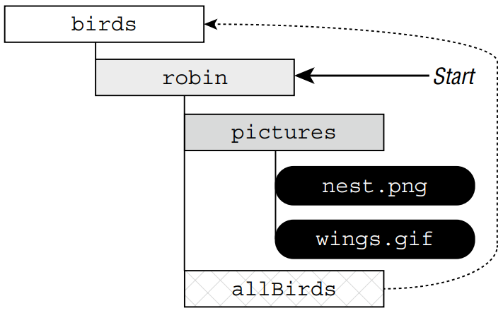

# Working with Advanced APIs
Files, paths, I/O streams: you’ve worked with a lot this chapter! In this final section,
we cover some advanced features of I/O streams and NIO.2 that can be quite useful in
practice—and have been known to appear on the exam from time to time!

## I. Manipulating Input Streams
All input stream classes include the following methods to manipulate the order in which data
is read from an I/O stream:

```java
// InputStream and Reader
public boolean markSupported()
public void mark(int readLimit)
public void reset() throws IOException
public long skip(long n) throws IOException
```

&emsp;&emsp;
The `mark()` and `reset()` methods return an I/O stream to an earlier position. Before
calling either of these methods, you should call the `markSupported()` method, which
returns **true** only if `mark()` is supported. The `skip()` method is pretty simple; it basically
reads data from the I/O stream and discards the contents.

> #### Tip
> Not all input stream classes support `mark()` and `reset()`. Make sure to
call `markSupported()` on the I/O stream before calling these methods,
or an exception will be thrown at runtime.

### &emsp;&emsp; 1. Marking Data
Assume that we have an **InputStream** instance whose next values are **LION**. Consider the
following code snippet:

```java
public void readData(InputStream is) throws IOException {
    System.out.print((char) is.read());     // L
    if (is.markSupported()) {
        is.mark(100);   // Marks up to 100 bytes
        System.out.print((char) is.read()); // I
        System.out.print((char) is.read()); // O
        is.reset();     // Resets stream to position before I
    }
    System.out.print((char) is.read()); // I
    System.out.print((char) is.read()); // O
    System.out.print((char) is.read()); // N
}
```

&emsp;&emsp;
The code snippet will output **LIOION** if `mark()` is supported and **LION** otherwise. It’s
a good practice to organize your `read()` operations so that the I/O stream ends up at the
same position regardless of whether `mark()` is supported. <br />

&emsp;&emsp;
What about the value of **100** that we passed to the `mark()` method? This value is called
the **readLimit**. It instructs the I/O stream that we expect to call `reset()` after at most
**100** bytes. If our program calls `reset()` after reading more than **100** bytes from calling
`mark(100)`, it may throw an exception, depending on the I/O stream class.

> #### Tip
> In actuality, `mark()` and `reset()` are not putting the data back into the
I/O stream but are storing the data in a temporary buffer in memory to be
read again. Therefore, you should not call the `mark()` operation with too
large a value, as this could take up a lot of memory.

### &emsp;&emsp; 2. Skipping Data
Assume that we have an **InputStream** instance whose next values are **TIGERS**. Consider
the following code snippet:

```java
System.out.print ((char)is.read()); // T
is.skip(2); // Skips I and G
is.read();  // Reads E but doesn't output it
System.out.print((char)is.read()); // R
System.out.print((char)is.read()); // S
```

&emsp;&emsp;
This code prints **TRS** at runtime. We skipped two characters, **I** and **G**. We also read **E** but
didn’t use it anywhere, so it behaved like calling `skip(1)`. <br />

&emsp;&emsp;
The return parameter of `skip()` tells us how many values were skipped. For example, if we
are near the end of the I/O stream and call `skip(1000)`, the return value might be **20**, indicating
that the end of the I/O stream was reached after **20** values were skipped. Using the return
value of `skip()` is important if you need to keep track of where you are in an I/O stream and
how many bytes have been processed.

### &emsp;&emsp; 3. Reviewing Manipulation APIs
Table 14.11 reviews these APIs related to manipulating I/O input streams. While you may
not have used these in practice, you need to know them for the exam.

> **Table 14.11** Common I/O stream methods
> 
> | Method name | Description |
> | --- | --- |
> |public boolean **markSupported**() |Returns **true** if stream class supports mark()
> |public **mark**(int readLimit) |Marks current position in stream
> |public void **reset**() |Attempts to reset stream to mark() position
> |public long **skip**(long n) |Reads and discards specified number of characters

## II. Discovering File Attributes
We begin our discussion by presenting the basic methods for reading file attributes. These
methods are usable within any file system, although they may have limited meaning in some
file systems.

### &emsp;&emsp; 1. Checking for Symbolic Links
Earlier, we saw that the **Files** class has methods called `isDirectory()` and
`isRegularFile()`, which are similar to the `isDirectory()` and `isFile()` methods on
**File**. While the **File** object can’t tell you if a reference is a symbolic link, the
`isSymbolicLink()` method on **Files** can. <br />

&emsp;&emsp;
It is possible for `isDirectory()` or `isRegularFile()` to return **true** for a symbolic
link, as long as the link resolves to a directory or regular file, respectively. Let’s take a look at
some sample code:

```java
System.out.print(Files.isDirectory(Paths.get("/canine/fur.jpg")));
System.out.print(Files.isSymbolicLink(Paths.get("/canine/coyote")));
System.out.print(Files.isRegularFile(Paths.get("/canine/types.txt")));
```

&emsp;&emsp;
The first example prints true if **fur.jpg** is a directory or a symbolic link to a directory
and **false** otherwise. The second example prints **true** if **/canine/coyote** is a symbolic
link, regardless of whether the file or directory it points to exists. The third example prints
**true** if **types.txt** points to a regular file or a symbolic link that points to a regular file.

### &emsp;&emsp; 2. Checking File Accessibility
In many file systems, it is possible to set a **boolean** attribute to a file that marks it hidden,
readable, or executable. The **Files** class includes methods that expose this information:
`isHidden()`, `isReadable()`, `isWriteable()`, and `isExecutable()`. <br />

&emsp;&emsp;
A hidden file can’t normally be viewed when listing the contents of a directory. The readable, 
writable, and executable flags are important in file systems where the filename can be
viewed, but the user may not have permission to open the file’s contents, modify the file, or
run the file as a program, respectively. <br />

&emsp;&emsp;
Here we present an example of each method:

```java
System.out.print(Files.isHidden(Paths.get("/walrus.txt")));
System.out.print(Files.isReadable(Paths.get("/seal/baby.png")));
System.out.print(Files.isWritable(Paths.get("dolphin.txt")));
System.out.print(Files.isExecutable(Paths.get("whale.png")));
```

&emsp;&emsp;
If the w**alrus.txt** file exists and is hidden within the file system, the first example prints
**true**. The second example prints **true** if the **baby.png** file exists and its contents are readable. 
The third example prints **true** if the **dolphin.txt** file can be modified. Finally, the
last example prints **true** if the file can be executed within the operating system. Note that
the file extension does not necessarily determine whether a file is executable. For example, an
image file that ends in **.png** could be marked executable in some file systems. <br />

&emsp;&emsp;
With the exception of the `isHidden()` method, these methods do not declare any checked
exceptions and return **false** if the file does not exist.

### &emsp;&emsp; 3. Improving Attribute Access
Up until now, we have been accessing individual file attributes with multiple method calls.
While this is functionally correct, there is often a cost each time one of these methods is
called. Put simply, it is far more efficient to ask the file system for all of the attributes at once
rather than performing multiple round trips to the file system. Furthermore, some attributes
are file system–specific and cannot be easily generalized for all file systems. <br />

&emsp;&emsp;
NIO.2 addresses both of these concerns by allowing you to construct views for various
file systems with a single method call. A _view_ is a group of related attributes for a particular
file system type. That’s not to say that the earlier attribute methods that we just finished 
discussing do not have their uses. If you need to read only one attribute of a file or directory,
requesting a view is unnecessary.

### &emsp;&emsp; 4. Understanding Attribute and View Types
NIO.2 includes two methods for working with attributes in a single method call: a read-only
attributes method and an updatable view method. For each method, you need to provide a
file system type object, which tells the NIO.2 method which type of view you are requesting.
By updatable view, we mean that we can both read and write attributes with the same object. <br />

&emsp;&emsp;
Table 14.12 lists the commonly used attributes and view types. For the exam, you
only need to know about the basic file attribute types. The other views are for managing
operating system–specific information.

> **Table 14.12** The attributes and view types
> 
> | Attribute interface | View interface | Description |
> | --- | --- | --- |
> |BasicFileAttributes |BasicFileAttributeView |Basic set of attributes supported by all file systems
> |DosFileAttributes |DosFileAttributeView |Basic set of attributes along with those supported by DOS/Windows-based systems
> |PosixFileAttributes |PosixFileAttributeView |Basic set of attributes along with those supported by POSIX systems, such as Unix, Linux, Mac, etc.

### &emsp;&emsp; 5. Retrieving Attributes
The **Files** class includes the following method to read attributes of a class in a 
readonly capacity:

```java
public static <A extends BasicFileAttributes> A readAttributes(
    Path path,
    Class<A> type,
    LinkOption... options) throws IOException
```

&emsp;&emsp;
Applying it requires specifying the Path and BasicFileAttributes.class
parameters.

```java
var path = Paths.get("/turtles/sea.txt");
BasicFileAttributes data = Files.readAttributes(path,
 BasicFileAttributes.class);

System.out.println("Is a directory? " + data.isDirectory());
System.out.println("Is a regular file? " + data.isRegularFile());
System.out.println("Is a symbolic link? " + data.isSymbolicLink());
System.out.println("Size (in bytes): " + data.size());
System.out.println("Last modified: " + data.lastModifiedTime());
```

&emsp;&emsp;
The **BasicFileAttributes** class includes many values with the same name as the attribute 
methods in the **Files** class. The advantage of using this method, though, is that all of
the attributes are retrieved at once for some operating systems.

### &emsp;&emsp; 6. Modifying Attributes
The following Files method returns an updatable view:

```java
public static <V extends FileAttributeView> V getFileAttributeView(
    Path path,
    Class<V> type,
    LinkOption... options)
```

&emsp;&emsp;
We can use the updatable view to increment a file’s last modified date/time value by
10,000 milliseconds, or 10 seconds.

```java
// Read file attributes
var path = Paths.get("/turtles/sea.txt");
BasicFileAttributeView view = Files.getFileAttributeView(path,
    BasicFileAttributeView.class);
BasicFileAttributes attributes = view.readAttributes();

// Modify file last modified time
FileTime lastModifiedTime = FileTime.fromMillis(
        attributes.lastModifiedTime().toMillis() + 10_000);
view.setTimes(lastModifiedTime, null, null);
```

&emsp;&emsp;
After the updatable view is retrieved, we need to call `readAttributes()` on the view to
obtain the file metadata. From there, we create a new **FileTime** value and set it using the
`setTimes()` method:

```java
// BasicFileAttributeView instance method
public void setTimes(FileTime lastModifiedTime,
    FileTime lastAccessTime, FileTime createTime)
```

&emsp;&emsp;
This method allows us to pass **null** for any date/time value that we do not want to
modify. In our sample code, only the last modified date/time is changed.

> #### Note
> Not all file attributes can be modified with a view. For example, you
cannot set a property that changes a file into a directory. Likewise, you
cannot change the size of the object without modifying its contents.

## III. Traversing a Directory Tree
While the `Files.list()` method is useful, it traverses the contents of only a single
directory. What if we want to visit all of the paths within a directory tree? Before we proceed, 
we need to review some basic concepts about file systems. Remember that a directory
is organized in a hierarchical manner. For example, a directory can contain files and other
directories, which can in turn contain other files and directories. Every record in a file system
has exactly one parent, with the exception of the root directory, which sits atop everything. <br />

&emsp;&emsp;
A file system is commonly visualized as a tree with a single root node and many branches
and leaves. In this model, a directory is a branch or internal node, and a file is a leaf node. <br />

&emsp;&emsp;
A common task in a file system is to iterate over the descendants of a path, either
recording information about them or, more commonly, filtering them for a specific set of
files. For example, you may want to search a folder and print a list of all of the **.java** files.
Furthermore, file systems store file records in a hierarchical manner. Generally speaking, if
you want to search for a file, you have to start with a parent directory, read its child 
elements, then read their children, and so on. <br />

&emsp;&emsp;
_Traversing a directory_, also referred to as walking a directory tree, is the process by which
you start with a parent directory and iterate over all of its descendants until some condition
is met or there are no more elements over which to iterate. For example, if we’re searching
for a single file, we can end the search when the file is found or we’ve checked all files and
come up empty. The starting path is usually a specific directory; after all, it would be 
time-consuming to search the entire file system on every request!

> #### Don’t Use _DirectoryStream_ and _FileVisitor_
> While browsing the NIO.2 Javadocs, you may come across methods that use the
**DirectoryStream** and **FileVisitor** classes to traverse a directory. These methods
predate the existence of the Stream API and were even required knowledge for older Java
certification exams.
> 
> The best advice we can give you is to not use them. The newer Stream API–based methods
are superior and accomplish the same thing, often with much less code.

### &emsp;&emsp; 1. Selecting a Search Strategy
Two common strategies are associated with walking a directory tree: a depth-first search and
a breadth-first search. A _depth-first_ search traverses the structure from the root to an 
arbitrary leaf and then navigates back up toward the root, traversing fully any paths it skipped
along the way. The _search depth_ is the distance from the root to current node. To prevent
endless searching, Java includes a search depth that is used to limit how many levels (or
hops) from the root the search is allowed to go. <br />

&emsp;&emsp;
Alternatively, a _breadth-first search_ starts at the root and processes all elements of each
particular depth before proceeding to the next depth level. The results are ordered by depth,
with all nodes at depth 1 read before all nodes at depth 2, and so on. While a breadth-first
search tends to be balanced and predictable, it also requires more memory since a list of 
visited nodes must be maintained. <br />

&emsp;&emsp;
For the exam, you don’t have to understand the details of each search strategy that Java
employs; you just need to be aware that the NIO.2 Stream API methods use depth-first
searching with a depth limit, which can be optionally changed.

### &emsp;&emsp; 2. Walking a Directory
That’s enough background information; let’s get to more Stream API methods. The Files class
includes two methods for walking the directory tree using a depth-first search.

```java
public static Stream<Path> walk(Path start,
    FileVisitOption... options) throws IOException
    
public static Stream<Path> walk(Path start, int maxDepth,
    FileVisitOption... options) throws IOException
```

&emsp;&emsp;
Like our other stream methods, `walk()` uses lazy evaluation and evaluates a **Path** only
as it gets to it. This means that even if the directory tree includes hundreds or thousands of
files, the memory required to process a directory tree is low. The first `walk()` method relies
on a default maximum depth of **Integer.MAX_VALUE**, while the overloaded version allows
the user to set a maximum depth. This is useful in cases where the file system might be large
and we know the information we are looking for is near the root. <br />

&emsp;&emsp;
Rather than just printing the contents of a directory tree, we can again do something
more interesting. The following `getPathSize()` method walks a directory tree and returns
the total size of all the files in the directory:

```java
private long getSize(Path p) {
    try {
        return Files.size(p);
    } catch (IOException e) {
        throw new UncheckedIOException(e);
    }
}

public long getPathSize(Path source) throws IOException {
    try (var s = Files.walk(source)) {
        return s.parallel()
                .filter(p -> !Files.isDirectory(p))
                .mapToLong(this::getSize)
                .sum();
    }
}
```

&emsp;&emsp;
The `getSize()` helper method is needed because `Files.size()` declares
**IOException**, and we’d rather not put a **try**/**catch** block inside a lambda expression.
Instead, we wrap it in the unchecked exception class **UncheckedIOException**. We can
print the data using the `format()` method:

```java
var size = getPathSize(Path.of("/fox/data"));
System.out.format("Total Size: %.2f megabytes", (size/1000000.0));
```

&emsp;&emsp;
Depending on the directory you run this on, it will print something like this:

```
Total Size: 15.30 megabytes
```

### &emsp;&emsp; 3. Applying a Depth Limit
Let’s say our directory tree is quite deep, so we apply a depth limit by changing one line of
code in our `getPathSize()` method.

```
        try (var s = Files.walk(source, 5)) {
```

&emsp;&emsp;
This new version checks for files only within 5 steps of the starting node. A depth value
of 0 indicates the current path itself. Since the method calculates values only on files, you’d
have to set a depth limit of at least 1 to get a nonzero result when this method is applied to a
directory tree.

### &emsp;&emsp; 4. Avoiding Circular Paths
Many of our earlier NIO.2 methods traverse symbolic links by default, with a
**NOFOLLOW_LINKS** used to disable this behavior. The `walk()` method is different in that
it does not follow symbolic links by default and requires the **FOLLOW_LINKS** option to be
enabled. We can alter our getPathSize() method to enable following symbolic links by
adding the FileVisitOption:

```
    try (var s = Files.walk(source,
        FileVisitOption.FOLLOW_LINKS)) {
```

&emsp;&emsp;
When traversing a directory tree, your program needs to be careful of symbolic links, if
enabled. For example, if our process comes across a symbolic link that points to the root
directory of the file system, every file in the system will be searched! <br />

&emsp;&emsp;
Worse yet, a symbolic link could lead to a cycle in which a path is visited repeatedly. A
_cycle_ is an infinite circular dependency in which an entry in a directory tree points to one of
its ancestor directories. Let’s say we had a directory tree as shown in Figure 14.7 with the
symbolic link **/birds/robin/allBirds** that points to **/birds**.

> **Figure 14.7** File system with cycle



&emsp;&emsp;
What happens if we try to traverse this tree and follow all symbolic links, starting with
**/birds/robin**? Table 14.13 shows the paths visited after walking a depth of **3**. For simplicity, 
we walk the tree in a breadth-first ordering, _although a cycle occurs regardless of the
search strategy used_.

> **Table 14.13** Walking a directory with a cycle using breadth-first search
> 
> |Depth|Path reached|
> |---|---|
> |0 |/birds/robin
> |1 |/birds/robin/pictures
> |1 |/birds/robin/allBirds<br />➢ /birds
> |2 |/birds/robin/pictures/nest.png
> |2 |/birds/robin/pictures/wings.gif
> |2 |/birds/robin/allBirds/robin<br/>➢ /birds/robin
> |3 |/birds/robin/allBirds/robin/pictures<br/>➢ /birds/robin/pictures
> |3 |/birds/robin/allBirds/robin/pictures/allBirds<br/>/birds/robin/allBirds<br/>➢ /birds

&emsp;&emsp;
After walking a distance of 1 from the start, we hit the symbolic link
**/birds/robin/allBirds** and go back to the top of the directory tree **/birds**. That’s okay
because we haven’t visited **/birds** yet, so there’s no cycle yet! <br />

&emsp;&emsp;
Unfortunately, at depth 2, we encounter a cycle. We’ve already visited the **/birds/robin**
directory on our first step, and now we’re encountering it again. If the process continues,
we’ll be doomed to visit the directory over and over again. <br />

&emsp;&emsp;
Be aware that when the **FOLLOW_LINKS** option is used, the `walk()` method will track all
of the paths it has visited, throwing a **FileSystemLoopException** if a path is visited twice.

## IV. Searching a Directory
In the previous example, we applied a filter to the **Stream<Path>** object to filter the results,
although there is a more convenient method.

```java
public static Stream<Path> find(Path start,
    int maxDepth,
    BiPredicate<Path, BasicFileAttributes> matcher,
    FileVisitOption... options) throws IOException
```

&emsp;&emsp;
The `find()` method behaves in a similar manner as the `walk()` method, except that it
takes a **BiPredicate** to filter the data. It also requires a depth limit to be set. Like `walk()`,
`find()` also supports the **FOLLOW_LINK** option. <br />

&emsp;&emsp;
The two parameters of the **BiPredicate** are a **Path** object and a
**BasicFileAttributes** object, which you saw earlier in the chapter. In this manner, Java
automatically retrieves the basic file information for you, allowing you to write complex
lambda expressions that have direct access to this object. We illustrate this with the 
following example:

```java
Path path = Paths.get("/bigcats");
long minSize = 1_000;
try (var s = Files.find(path, 10,
    (p, a) -> a.isRegularFile() 
            && p.toString().endsWith(".java")
            && a.size() > minSize)) {
    s.forEach(System.out::println);
}
```

&emsp;&emsp;
This example searches a directory tree and prints all **.java** files with a size of at least
**1,000 bytes**, using a depth limit of **10**. While we could have accomplished this using the
`walk()` method along with a call to `readAttributes()`, this implementation is a lot
shorter and more convenient than those would have been. We also don’t have to worry
about any methods within the lambda expression declaring a checked exception, as we saw
in the `getPathSize()` example.
