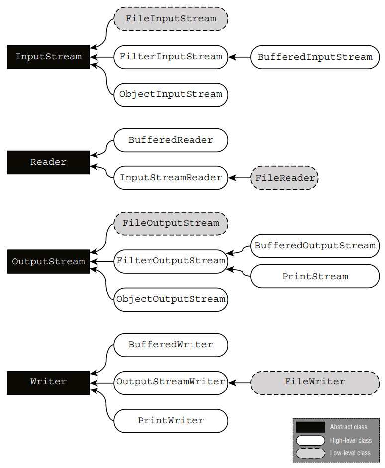

# Review of Key APIs

The key APIs that you need to know for the exam are listed in Table 14.14. We know some
of the classes look similar. You need to know this table really well before taking the exam.

> **Table 14.14** Key APIs
> 
> |Class|Purpose|
> |---|---|
> |File |I/O representation of location in file system
> |Files |Helper methods for working with Path
> |Path |NIO.2 representation of location in file system
> |Paths |Contains factory methods to get Path
> |URI |Uniform resource identifier for files, URLs, etc.
> |FileSystem |NIO.2 representation of file system
> |FileSystems |Contains factory methods to get FileSystem
> |InputStream |Superclass for reading files based on bytes
> |OuputStream |Superclass for writing files based on bytes
> |Reader |Superclass for reading files based on characters
> |Writer |Superclass for writing files based on characters

&emsp;&emsp;
Additionally, Figure 14.8 shows all of the I/O stream classes that you should be familiar
with for the exam, with the exception of the filter streams. **FilterInputStream** and
**FilterOutputStream** are high-level superclasses that filter or transform data. They are
rarely used directly.

> **Figure 14.8** Diagram of I/O stream classes

 
&emsp;&emsp;
The **InputStreamReader** and **OutputStreamWriter** are incredibly convenient
and are also unique in that they are the only I/O stream classes to have both
**InputStream**/**OutputStream** and **Reader**/**Writer** in their name.