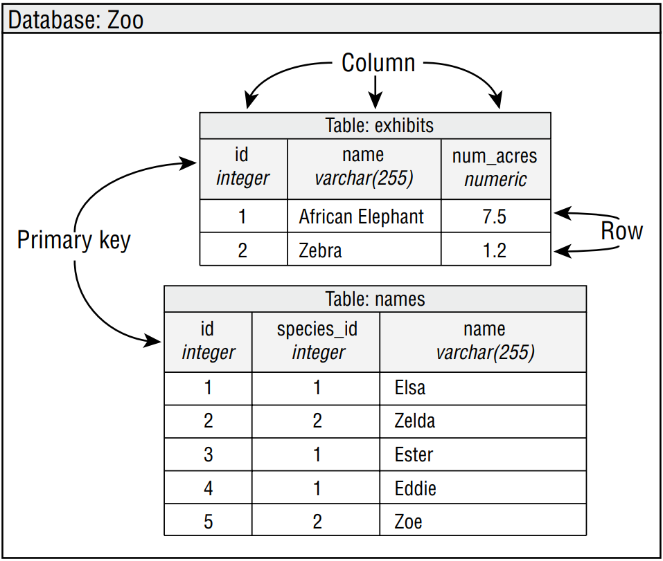

# Introducing Relational Databases and SQL

_Data_ is information. A piece of data is one fact, such as your first name. A _database_ is an
organized collection of data. In the real world, a file cabinet is a type of database. It has
file folders, each of which contains pieces of paper. The file folders are organized in some
way, often alphabetically. Each piece of paper is like a piece of data. Similarly, the folders
on your computer are like a database. The folders provide organization, and each file is a
piece of data.  

&emsp;&emsp;
A _relational database_ is a database that is organized into _tables_, which consist of rows
and columns. You can think of a table as a spreadsheet. There are two main ways to access a
relational database from Java:
- _Java Database Connectivity_ (JDBC): Accesses data as rows and columns. JDBC is the
API covered in this chapter.
- _Java Persistence_ API (JPA): Accesses data through Java objects using a concept called
_object-relational mapping_ (ORM). The idea is that you don’t have to write as much
code, and you get your data in Java objects. JPA is not on the exam, and therefore it is
not covered in this chapter.

&emsp;&emsp;
A relational database is accessed through Structured Query Language (SQL). SQL is a
programming language used to interact with database records. JDBC works by sending a
SQL command to the database and then processing the response.  

&emsp;&emsp;
In addition to relational databases, there is another type of database called a _NoSQL
database_. These databases store their data in a format other than tables, such as key/value,
document stores, and graph-based databases. NoSQL is out of scope for the exam as well.  

&emsp;&emsp;
In the following sections, we introduce a small relational database that we will be using
for the examples in this chapter and present the SQL to access it. We also cover some 
vocabulary that you need to know.

> #### Running the Examples in the Chapter
> In most chapters of this book, you need to write code and try lots of examples. This chapter
is different. It’s still nice to try the examples, but you can probably get the JDBC questions
correct on the exam from just reading this chapter and mastering the review questions.
> 
> While the exam is database agnostic, we had to use a database for the examples, and we
chose the HyperSQL database. It is a small, in-memory database. In fact, you need only one
JAR file to run it. For real projects, we like MySQL and PostgreSQL.
> 
> Instructions to download and set up the database for the examples in the chapter are in:
>
> www.selikoff.net/ocp17
>
> For now, you don’t need to understand any of the code on the website. It is just to get you
set up. In a nutshell, it connects to the database and creates two tables. By the end of this
chapter, you should understand how to create a **Connection** and **PreparedStatement**
in this manner.
>
> There are plenty of tutorials for installing and getting started with any of these. It’s beyond
the scope of the book and the exam to set up a database, but feel free to ask questions in
the database/JDBC section of CodeRanch. You might even get an answer from the authors.

## I. Identifying the Structure of a Relational Database
Our sample database has two tables. One has a row for each species that is in our zoo. The
other has a row for each animal. These two relate to each other because an animal belongs
to a species. These relationships are why this type of database is called a relational database.
Figure 15.1 shows the structure of our database.

> **Figure 15.1** Tables in our relational database

&emsp;&emsp;
As you can see in Figure 15.1, we have two tables. One is named **exhibits**, and the
other is named **names**. Each table has a _primary key_, which gives us a unique way to reference 
each row. After all, two animals might have the same name, but they can’t have the
same ID. You don’t need to know about keys for the exam. We mention them to give you
a bit of context. In our example, it so happens that the primary key is only one column. In
some situations, it is a combination of columns called a _compound key_. For example, a student 
identifier and year might be a compound key.  

&emsp;&emsp;
There are two rows and three columns in the **exhibits** table and five rows and three
columns in the **names** table. You do need to know about rows and columns for the exam.

## II. Writing Basic SQL Statements
The most important thing that you need to know about SQL for the exam is that there
are four types of statements for working with the data in tables. They are referred to as
CRUD (Create, Read, Update, Delete). The SQL keywords don’t match the acronym, so pay
attention to the SQL keyword for each in Table 15.1.

> **Table 15.1** CRUD operations
> 
> |Operation|SQL keyword|Description|
> |---|---|---|
> |**C**reate |INSERT |Adds new row to table
> |**R**ead |SELECT |Retrieves data from table
> |**U**pdate |UPDATE |Changes zero or more rows in table
> |**D**elete |DELETE |Removes zero or more rows from table

&emsp;&emsp;
That’s it. You are not expected to determine whether SQL statements are correct. You are
not expected to spot syntax errors in SQL statements. You are not expected to write SQL
statements. Notice a theme?  

&emsp;&emsp;
Unlike Java, SQL keywords are case insensitive. This means **select**, **SELECT**, and
**Select** are all equivalent. Like Java primitive types, SQL has a number of data types.
Most are self-explanatory, like **INTEGER**. There’s also **DECIMAL**, which functions a lot like
a **double** in Java. The strangest one is **VARCHAR**, standing for “variable character,” which is
like a **String** in Java. The _variable_ part means that the database should use only as much
space as it needs to store the value.  

&emsp;&emsp;
While you don’t have to know how to write them, we present the basic four SQL statements 
in Table 15.2 since they appear in many questions.

> **Table 15.2** SQL
> 
> |SQL keyword|Explanation|
> |---|---|
> |INSERT INTO exhibits VALUES (3, 'Asian Elephant', 7.5); |Adds new row with provided values. Defaults to order in which columns were defined in table.
> |SELECT * FROM exhibits WHERE ID = 3; |Reads data from table with optional WHERE clause to limit data returned. In SELECT, can use * to return all columns, list specific ones to return, or even call functions like COUNT(*) to return number of matching rows.
> |UPDATE exhibits SET num_acres = num_acres + .5 WHERE name = 'Asian Elephant'; |Sets column’s value with optional WHERE clause to limit rows updated.
> |DELETE FROM exhibits HERE name = 'Asian Elephant'; |Deletes rows with optional WHERE clause to limit rows deleted.
