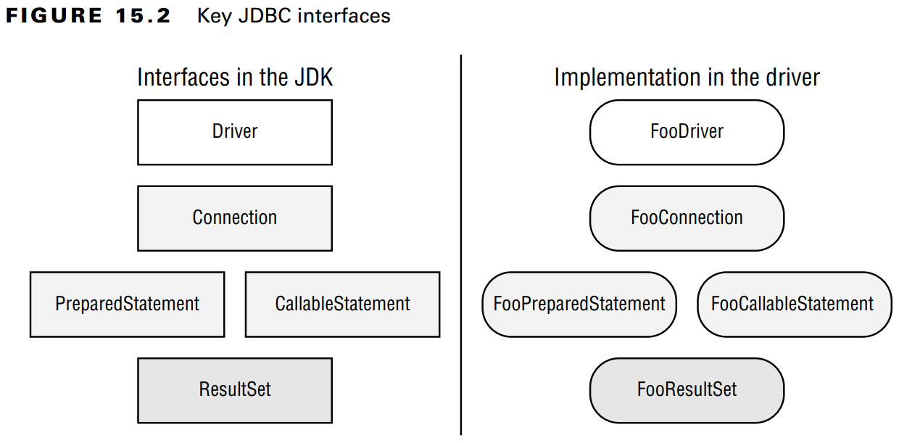

# Introducing the Interfaces of JDBC

For the exam, you need to know five key interfaces of JDBC. The interfaces are declared
in the JDK. They are just like all of the other interfaces and classes that you’ve seen in this
book. For example, in Chapter 9, “Collections and Generics,” you worked with the interface
**List** and the concrete class **ArrayList**. <br />

&emsp;&emsp;
With JDBC, the concrete classes come from the JDBC driver. Each database has a
different JAR file with these classes. For example, PostgreSQL’s JAR is called something
like **postgresql-9.4–1201.jdbc4.jar**. MySQL’s JAR is called something like
**mysql-connector-java-5.1.36.jar**. The exact name depends on the vendor and version 
of the driver JAR. <br />

&emsp;&emsp;
This driver JAR contains an implementation of these key interfaces along with a number
of other interfaces. The key is that the provided implementations know how to communicate
with a database. There are also different types of drivers; luckily, you don’t need to know
about this for the exam. <br />

&emsp;&emsp;
Figure 15.2 shows the five key interfaces that you need to know. It also shows that the
implementation is provided by an imaginary Foo driver JAR. They cleverly stick the name
Foo in all classes. <br />

&emsp;&emsp;
You’ve probably noticed that we didn’t tell you what the implementing classes are called
in any real database. The main point is that you shouldn’t know. With JDBC, you use only
the interfaces in your code and never the implementation classes directly. In fact, they might
not even be public classes. <br />

&emsp;&emsp;
What do these five interfaces do? On a very high level, we have the following:
- Driver: Establishes a connection to the database
- Connection: Sends commands to a database
- PreparedStatement: Executes a SQL query
- CallableStatement: Executes commands stored in the database
- ResultSet: Reads the results of a query

> **Figure 15.2** Key JDBC interfaces



&emsp;&emsp;
All database interfaces are in the package **java.sql**, so we often omit the imports
throughout this chapter. <br />

&emsp;&emsp;
In this next example, we show you what JDBC code looks like, end to end. If you are
new to JDBC, just notice that three of the five interfaces are in the code. If you are 
experienced, remember that the exam uses the **DriverManager** class instead of the DataSource
interface.

```java
public class MyFirstDatabaseConnection {
    public static void main(String[] args) throws SQLException {
        String url = "jdbc:hsqldb:file:zoo";
        try (Connection conn = DriverManager.getConnection(url);    
             PreparedStatement ps = conn.prepareStatement(
                "SELECT name FROM exhibits");
             ResultSet rs = ps.executeQuery()) {
             while (rs.next())
                 System.out.println(rs.getString(1));
        } } }
```

&emsp;&emsp;
If the URL were using our imaginary **Foo** driver, **DriverManager** would return an instance 
of **FooConnection**. Calling `prepareStatement()` would then return an instance
of **FooPreparedStatement**, and calling `executeQuery()` would return an instance of
**FooResultSet**. Since the URL uses **hsqldb** instead, it returns the implementations that
**HyperSQL** has provided for these interfaces. You don’t need to know their names. In the rest
of the chapter, we explain how to use all five of the interfaces and go into more detail about
what they do. By the end of the chapter, you’ll be writing code like this yourself.

> #### Compiling with Modules
> Almost all the packages on the exam are in the **java.base** module. As you may recall
from Chapter 12, “Modules,” this module is included automatically when you run your
application as a module.
> 
> In contrast, the JDBC classes are all in the module **java.sql**. They are also in the package
**java.sql**. The names are the same, so they should be easy to remember. When working
with SQL, you need the **java.sql** module and import **java.sql.***.
>
> We recommend separating your studies for JDBC and modules. You can use the classpath
when working with JDBC and reserve your practice with the module path for when you are
studying modules.
>
> That said, if you do want to use JDBC code with modules, remember to update your
**module-info** file to include the following:
> ```
>       requires java.sql;
> ```
