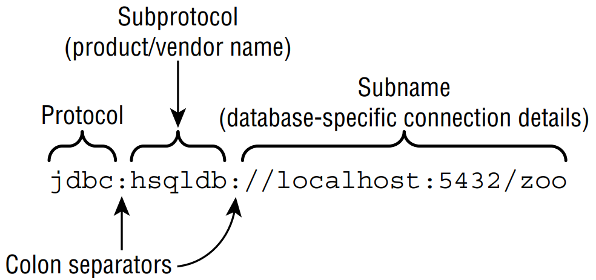

# Connecting to a Database

The first step in doing anything with a database is connecting to it. First we show you
how to build the JDBC URL. Then we show you how to use it to get a **Connection** to
the database.

## I. Building a JDBC URL
To access a website, you need to know its URL. To access your email, you need to know
your username and password. JDBC is no different. To access a database, you need to know
this information about it. <br />

&emsp;&emsp;
Unlike web URLs, JDBC URLs have a variety of formats. They have three parts in
common, as shown in Figure 15.3. The first piece is always the same. It is the protocol **jdbc**.
The second part is the _subprotocol_, which is the name of the database, such as **hsqldb**, **mysql**,
or **postgres**. The third part is the _subname_, which is a database-specific format. Colons (:)
separate the three parts. <br />

&emsp;&emsp;
The subname typically contains information about the database such as its location
and/or name. The syntax varies. You need to know about the three main parts. You don’t
need to memorize the subname formats. Phew! You’ve already seen one such URL:

```
jdbc:hsqldb:file:zoo
```

> **Figure 15.3** The JDBC URL format



&emsp;&emsp;
Notice the three parts. It starts with **jdbc**, and then comes the subprotocol **hsqldb**. It
ends with the subname, which tells us we are using the file system. The location is then the
database name. <br />

&emsp;&emsp;
Other examples of subnames are shown here:

```
jdbc:postgresql://localhost/zoo
jdbc:oracle:thin:@123.123.123.123:1521:zoo
jdbc:mysql://localhost:3306
jdbc:mysql://localhost:3306/zoo?profileSQL=true
```

&emsp;&emsp;
You can see that each of these JDBC URLs begins with jdbc, followed by a colon,
followed by the vendor/product name. After that, the URLs vary. Notice how all of them
include the location of the database: localhost, 123.123.123.123:1521, and
localhost:3306. Also, notice that the port is optional when using the default location.

## II. Getting a Database Connection
There are two main ways to get a **Connection**: **DriverManager** and **DataSource**.
**DriverManager** is the one covered on the exam. Do not use a **DriverManager** in code
someone is paying you to write. A **DataSource** has more features than **DriverManager**.
For example, it can pool connections or store the database connection information outside
the application. <br />

&emsp;&emsp;
The **DriverManager** class is in the JDK, as it is an API that comes with Java. It uses the
factory pattern, which means that you call a **static** method to get a **Connection** rather
than calling a constructor. As you saw in Chapter 11, “Exceptions and Localization,” the
factory pattern means that you can get any implementation of the interface when calling
the method. The good news is that the method has an easy-to-remember name:
`getConnection()`. <br />

&emsp;&emsp;
To get a **Connection** from the HyperSQL database, you write the following:

```java
import java.sql.*;
public class TestConnect {
    public static void main(String[] args) throws SQLException {
        try (Connection conn = 
                     DriverManager.getConnection("jdbc:hsqldb:file:zoo")) {
            System.out.println(conn);
        } } }
```

&emsp;&emsp;
As in Chapter 11, we use a try-with-resources statement to ensure that database resources
are closed. We cover closing database resources in more detail later in the chapter. We also
throw the checked **SQLException**, which means something went wrong. For example, you
might have forgotten to set the location of the database driver in your classpath. <br />

&emsp;&emsp;
Assuming the program runs successfully, it prints something like this:

```
org.hsqldb.jdbc.JDBCConnection@3dfc5fb8
```

&emsp;&emsp;
The details of the output aren’t important. Just notice that the class is not **Connection**. It
is a vendor implementation of **Connection**. <br />

&emsp;&emsp;
There is also a signature that takes a username and password.

```java
import java.sql.*;
public class TestExternal {
    public static void main(String[] args) throws SQLException {
        try (Connection conn = DriverManager.getConnection(
            "jdbc:postgresql://localhost:5432/ocp-book",
            "username",
            "Password20182")) {
            System.out.println(conn);
        } } }
```

&emsp;&emsp;
Notice the three parameters that are passed to `getConnection()`. The first is the JDBC
URL that you learned about in the previous section. The second is the username for accessing 
the database, and the third is the password for accessing the database. It should go
without saying that our password is not **Password20182**. Also, don’t put your password in
real code. It’s a horrible practice. Always load it from some kind of configuration, ideally one
that keeps the stored value encrypted. <br />

&emsp;&emsp;
If you were to run this with the Postgres driver JAR, it would print something like this:

```
org.postgresql.jdbc4.Jdbc4Connection@eed1f14
```

&emsp;&emsp;
Again, notice that it is a driver-specific implementation class. You can tell from
the package name. Since the package is `org.postgresql.jdbc4`, it is part of the
PostgreSQL driver. <br />

&emsp;&emsp;
Unless the exam specifies a command line, you can assume that the correct JDBC driver
JAR is in the classpath. The exam creators explicitly ask about the driver JAR if they want
you to think about it. <br />

&emsp;&emsp;
The nice thing about the factory pattern is that it takes care of the logic of creating a class
for you. You don’t need to know the name of the class that implements **Connection**, and you
don’t need to know how it is created. You are probably a bit curious, though. <br />

&emsp;&emsp;
**DriverManager** looks through any drivers it can find to see whether they can handle the
JDBC URL. If so, it creates a **Connection** using that **Driver**. If not, it gives up and throws a
**SQLException**.

> #### Note
> You might see `Class.forName()` in code. It was required with older
drivers (that were designed for older versions of JDBC) before getting a
**Connection**.
