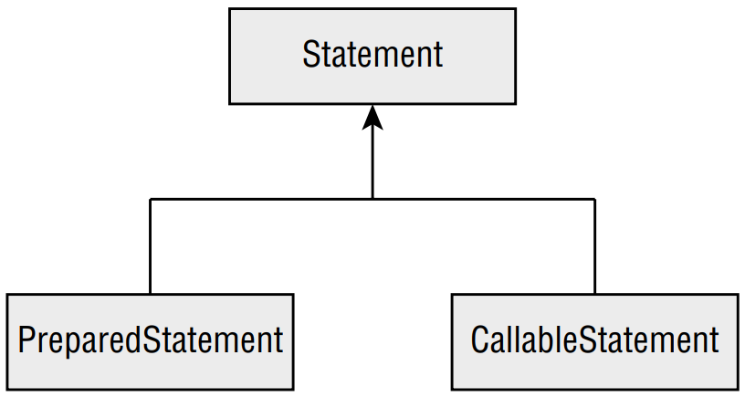

# Working with a _PreparedStatement_

In Java, you have a choice of working with a **Statement**, **PreparedStatement**, or
**CallableStatement**. The latter two are subinterfaces of **Statement**, as shown in
Figure 15.4.

> **Figure 15.4** Types of statements



&emsp;&emsp;
Later in the chapter, you learn about using **CallableStatement** for queries that are
inside the database. In this section, we look at **PreparedStatement**. <br />

&emsp;&emsp;
What about **Statement**, you ask? It is an interface that both **PreparedStatement** and
**CallableStatement** extend. A **Statement** and a **PreparedStatement** are similar to
each other, except that a **PreparedStatement** takes parameters, while a **Statement** does
not. A **Statement** just executes whatever SQL query you give it. <br />

&emsp;&emsp;
While it is possible to run SQL directly with **Statement**, you shouldn’t.
**PreparedStatement** is far superior for the following reasons:
- **Performance**: In most programs, you run similar queries multiple times. When you use
**PreparedStatement**, the database software often devises a plan to run the query well
and remembers it.
- **Security**: You are protected against an attack called SQL injection when using a
**PreparedStatement** correctly.
- **Readability**: It’s nice not to have to deal with string concatenation in building a query
string with lots of parameters.
- **Future use**: Even if your query is being run only once or doesn’t have any parameters,
you should still use a **PreparedStatement**. That way, future editors of the code won’t
add a variable and have to remember to change to **PreparedStatement** then.

> #### Little Bobby Tables
> SQL injection is often caused by a lack of properly sanitized user input. The author of the
popular [xkcd.com](xkcd.com), web-comic once asked the question, what would happen if someone’s
name contained a SQL statement?
> 
> “Exploits of a Mom” reproduced with permission from [xkcd.com/327/](xkcd.com/327/)
> 
> 
> 
> Oops! Guess the school should have used a **PreparedStatement** and bound each student’s 
name to a variable. If it had, the entire **String** would have been properly escaped
and stored in the database.

&emsp;&emsp;
Using the **Statement** interface directly is not in scope for the JDBC exam, so we do not
cover it in this book. In the following sections, we cover obtaining a **PreparedStatement**,
executing one, working with parameters, and running multiple updates.

## I. Obtaining a _PreparedStatement_

To run SQL, you need to tell a **PreparedStatement** about it. Getting a **PreparedStatement** from
a **Connection** is easy.

```java
try (PreparedStatement ps = conn.prepareStatement(
    "SELECT * FROM exhibits")) {
    // work with ps
}
```

&emsp;&emsp;
An instance of a **PreparedStatement** represents a SQL statement that you want to run
using the **Connection**. It does not execute the query yet! We get to that shortly. <br />

&emsp;&emsp;
Passing a SQL statement when creating the object is mandatory. You might see a trick
on the exam.

```java
try (var ps = conn.prepareStatement()) { // DOES NOT COMPILE
}
```

&emsp;&emsp;
The previous example does not compile, because SQL is not supplied at the time a
**PreparedStatement** is requested. We also used **var** in this example. We write JDBC code
both using **var** and the actual class names to get you used to both approaches. <br />

&emsp;&emsp;
There are overloaded signatures that allow you to specify a **ResultSet** type and 
concurrency mode. On the exam, you only need to know how to use the default options, which
process the results in order.

## II. Executing a _PreparedStatement_
Now that we have a **PreparedStatement**, we can run the SQL statement. The method for
running SQL varies depending on what kind of SQL statement it is. Remember that
you aren’t expected to be able to read SQL, but you do need to know what the first
keyword means.

### &emsp;&emsp; 1. Modifying Data with _executeUpdate()_
Let’s start with statements that change the data in a table. Those are SQL statements that
begin with **DELETE**, **INSERT**, or **UPDATE**. They typically use a method called `executeUpdate()`.
The name is a little tricky because the SQL **UPDATE** statement is not the only statement that
uses this method. <br />

&emsp;&emsp;
The method takes the SQL statement to run as a parameter. It returns the number of rows
that were inserted, deleted, or changed. Here’s an example of all three update types:

```
10: var insertSql = "INSERT INTO exhibits VALUES(10, 'Deer', 3)";
11: var updateSql = "UPDATE exhibits SET name = '' " +
12:     "WHERE name = 'None'";
13: var deleteSql = "DELETE FROM exhibits WHERE id = 10";
14:
15: try (var ps = conn.prepareStatement(insertSql)) {
16:     int result = ps.executeUpdate();
17:     System.out.println(result); // 1
18: }
19:
20: try (var ps = conn.prepareStatement(updateSql)) {
21:     int result = ps.executeUpdate();
22:     System.out.println(result); // 0
23: }
24:
25: try (var ps = conn.prepareStatement(deleteSql)) {
26:     int result = ps.executeUpdate();
27:     System.out.println(result); // 1
28: }
```

&emsp;&emsp;
For the exam, you don’t need to read SQL. The question will tell you how many rows
are affected if you need to know. Notice how each distinct SQL statement needs its own
`prepareStatement()` call. <br />

&emsp;&emsp;
Line 15 creates the insert statement, and line 16 runs that statement to insert one row.
The result is 1 because one row was affected. Line 20 creates the update statement, and line
21 checks the whole table for matching records to update. Since no records match, the result
is 0. Line 25 creates the delete statement, and line 26 deletes the row created on line 16.
Again, one row is affected, so the result is 1.

### &emsp;&emsp; 2. Reading Data with _executeQuery()_

Next, let’s look at a SQL statement that begins with **SELECT**. This time, we use the
`executeQuery()` method.

```
30: var sql = "SELECT * FROM exhibits";
31: try (var ps = conn.prepareStatement(sql);
32:     ResultSet rs = ps.executeQuery() ) {
33:
34:     // work with rs
35: }
```

&emsp;&emsp;
On line 31, we create a **PreparedStatement** for our **SELECT** query. On line 32, we run
it. Since we are running a query to get a result, the return type is **ResultSet**. In the next
section, we show you how to process the **ResultSet**.

### &emsp;&emsp; 3. Processing Data with _execute()_
There’s a third method called `execute()` that can run either a query or an update. It returns
a **boolean** so that we know whether there is a **ResultSet**. That way, we can call the proper
method to get more detail. The pattern looks like this:

```java
boolean isResultSet = ps.execute();
if (isResultSet) {
    try (ResultSet rs = ps.getResultSet()) {
        System.out.println("ran a query");
    }
} else {
    int result = ps.getUpdateCount();
    System.out.println("ran an update");
}
```

&emsp;&emsp;
If the **PreparedStatement** refers to sql that is a **SELECT**, the **boolean** is true, and we
can get the **ResultSet**. If it is not a **SELECT**, we can get the number of rows updated.

### &emsp;&emsp; 4. Using the Correct Method
What do you think happens if we use the wrong method for a SQL statement? Let’s
take a look:

```java
var sql = "SELECT * FROM names";
try (var ps = conn.prepareStatement(sql)) {
    var result = ps.executeUpdate();
}
```

&emsp;&emsp;
This throws a **SQLException** similar to the following:

```
Exception in thread "main" java.sql.SQLException: 
statement does not generate a row count
```

&emsp;&emsp;
We can’t get a compiler error since the SQL is a String. We can get an exception,
though, and we do. We also get a **SQLException** when using `executeQuery()` with SQL
that changes the database.

```
Exception in thread "main" java.sql.SQLException: 
statement does not generate a result set
```

&emsp;&emsp;
Again, we get an exception because the driver can’t translate the query into the expected
return type.

### &emsp;&emsp; 5. Reviewing _PreparedStatement_ Methods

To review, make sure that you know Table 15.3 and Table 15.4 well. Table 15.3
shows which SQL statements can be run by each of the three key methods on
**PreparedStatement**. Table 15.4 shows what is returned by each method.

> **Table 15.3** SQL runnable by the execute method
> 
> |Method|DELETE|INSERT|SELECT|UPDATE|
> |------|------|------|------|------|
> |ps.execute() |Yes |Yes |Yes |Yes
> |ps.executeQuery() |No |No |Yes |No
> |ps.executeUpdate() |Yes |Yes |No |Yes

> **Table 15.4** Return types of **execute** methods
> 
> |Method|Return type|What is returned for SELECT|What is returned for DELETE/INSERT/UPDATE|
> |---|---|---|---|
> |ps.execute() |boolean |true |false
> |ps.executeQuery() |ResultSet |Rows and columns returned |n/a
> |ps.executeUpdate() |int |n/a |Number of rows added/changed/removed

## III. Working with Parameters
Suppose our zoo acquires a new elephant and we want to register it in our **names** table.
We’ve already learned enough to do this.

```java
public static void register(Connection conn) throws SQLException {
    var sql = "INSERT INTO names VALUES(6, 1, 'Edith')";
    try (var ps = conn.prepareStatement(sql)) {
        ps.executeUpdate();
    }
}
```

&emsp;&emsp;
However, everything is hard-coded. We want to be able to pass in the values as parameters. 
Luckily, a **PreparedStatement** allows us to set parameters. Instead of specifying the
three values in the SQL, we can use a question mark (?). A _bind variable_ is a placeholder
that lets you specify the actual values at runtime. A bind variable is like a parameter, and you
will see bind variables referenced as both variables and parameters. We can rewrite our SQL
statement using bind variables.

```java
    String sql = "INSERT INTO names VALUES(?, ?, ?)";
```

&emsp;&emsp;
Bind variables make the SQL easier to read since you no longer need to use quotes
around **String** values in the SQL. Now we can pass the parameters to the method itself.

```
14: public static void register(Connection conn, int key,
15:     int type, String name) throws SQLException {
16:
17:     String sql = "INSERT INTO names VALUES(?, ?, ?)";
18:
19:     try (PreparedStatement ps = conn.prepareStatement(sql)) {
20:         ps.setInt(1, key);
21:         ps.setString(3, name);
22:         ps.setInt(2, type);
23:         ps.executeUpdate();
24:     }
25: }
```

&emsp;&emsp;
Line 19 creates a **PreparedStatement** using our SQL that contains three bind variables.
Lines 20–22 set those variables. You can think of the bind variables as a list of parameters,
where each is set in turn. Notice how the bind variables can be set in any order. Line 23 
executes the query and runs the update. <br />

&emsp;&emsp;
Notice how the bind variables are counted starting with 1 rather than 0. This is really
important, so we will repeat it.

> #### Note
> Remember that JDBC starts counting columns with 1 rather than 0.
A common exam question tests that you know this!

&emsp;&emsp;
In the previous example, we set the parameters out of order. That’s perfectly fine. The
rule is only that they are each set before the query is executed. Let’s see what happens if you
don’t set all the bind variables.

```java
var sql = "INSERT INTO names VALUES(?, ?, ?)";
try (var ps = conn.prepareStatement(sql)) {
    ps.setInt(1, key);
    ps.setInt(2, type);
    // missing the set for parameter number 3
    ps.executeUpdate();
}
```

&emsp;&emsp;
The code compiles, and you get a **SQLException**. The message may vary based on your
database driver.

```
Exception in thread "main" java.sql.SQLException: Parameter not set
```

&emsp;&emsp;
What about if you try to set more values than you have as bind variables?

```java
var sql = "INSERT INTO names VALUES(?, ?)";
try (var ps = conn.prepareStatement(sql)) {
    ps.setInt(1, key);
    ps.setInt(2, type);
    ps.setString(3, name);
    ps.executeUpdate();
}
```

&emsp;&emsp;
Again, you get a **SQLException**, this time with a different message. On HyperSQL, that
message was as follows:

```
Exception in thread "main" java.sql.SQLException:
row column count mismatch in statement [INSERT INTO names VALUES(?, ?)]
```

&emsp;&emsp;
Table 15.5 shows the methods you need to know for the exam to set bind variables. The
ones that you need to know for the exam are easy to remember since they are called **set** followed 
by the name of the type you are setting. There are many others, like dates, that are out
of scope for the exam.

> **Table 15.5** **PreparedStatement** methods
> 
> |Method|Parameter type|Example database type|
> |---|---|---|
> |setBoolean |boolean |BOOLEAN
> |setDouble |double |DOUBLE
> |setInt |int |INTEGER
> |setLong |long |BIGINT
> |setNull |int |Any type
> |setObject |Object |Any type
> |setString |String |CHAR, VARCHAR

&emsp;&emsp;
The first column shows the method name, and the second column shows the type that
Java uses. The third column shows the type name that could be in the database. There is
some variation by databases, so check your specific database documentation. You need to
know only the first two columns for the exam. <br />

&emsp;&emsp;
The `setNull()` method takes an int parameter representing the column type in the
database. You do not need to know these types. Notice that the `setObject()` method
works with any Java type. If you pass a primitive, it will be autoboxed into a wrapper type.
That means we can rewrite our example as follows:

```java
String sql = "INSERT INTO names VALUES(?, ?, ?)";
try (PreparedStatement ps = conn.prepareStatement(sql)) {
    ps.setObject(1, key);
    ps.setObject(2, type);
    ps.setObject(3, name);
    ps.executeUpdate();
}
```

&emsp;&emsp;
Java will handle the type conversion for you. It is still better to call the more specific setter
methods since that will give you a compile-time error if you pass the wrong type instead of a
runtime error.

## IV. Updating Multiple Records
Suppose we get two new elephants and want to add both. We can use the same
**PreparedStatement** object.

```java
var sql = "INSERT INTO names VALUES(?, ?, ?)";

try (var ps = conn.prepareStatement(sql)) {
    ps.setInt(1, 20);
    ps.setInt(2, 1);
    ps.setString(3, "Ester");
    ps.executeUpdate();
    
    ps.setInt(1, 21);
    ps.setString(3, "Elias");
    ps.executeUpdate();
}
```

&emsp;&emsp;
Note that we set all three parameters when adding **Ester** but only two for **Elias**. The
**PreparedStatement** is smart enough to remember the parameters that were already set
and retain them. You only have to set the ones that are different.

> ### Real World Scenario
> #### Batching Statements
> JDBC supports batching so you can run multiple statements in fewer trips to the database.
Often the database is located on a different machine than the Java code runs on. Saving
trips to the database saves time because network calls can be expensive. For example, if
you need to insert 1,000 records into the database, inserting them as a single network call
(as opposed to 1,000 network calls) is usually a _lot_ faster.
> 
> You don’t need to know the `addBatch()` and `executeBatch()` methods for the exam,
but they are useful in practice.
> 
> ```
>       public static void register(Connection conn, int firstKey,
>           int type, String... names) throws SQLException {
> 
>           var sql = "INSERT INTO names VALUES(?, ?, ?)";
>           var nextIndex = firstKey;
> 
>           try (var ps = conn.prepareStatement(sql)) {
>               ps.setInt(2, type);
> 
>               for (var name: names) {
>                   ps.setInt(1, nextIndex);
>                   ps.setString(3, name);
>                   ps.addBatch();
> 
>                   nextIndex++;
>               }
>               int[] result = ps.executeBatch();
>               System.out.println(Arrays.toString(result));
>           }
>       }
> ```
> 
> Now we call this method with two names:
> 
> ```
>       register(conn, 100, 1, "Elias", "Ester");
> ```
> 
> The output shows that the array has two elements since there are two different items in the 
batch. Each added one row in the database.
> ```
>       [1, 1]
> ```
> 
> You can use batching to break up large operations, such as inserting 10 million records in
groups of 100. In practice, it takes a bit of work to determine an appropriate batch size, but
the performance of using batch is normally far better than inserting one row at a time (or all
ten million at once).


