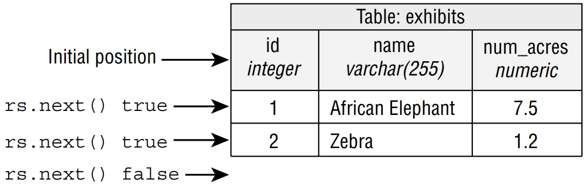

# Getting Data from a ResultSet
A database isn’t useful if you can’t get your data. We start by showing you how to go
through a **ResultSet**. Then we go through the different methods to get columns by type.

## I. Reading a _ResultSet_

When working with a **ResultSet**, most of the time, you will write a loop to look at each row.
The code looks like this:

```
20: String sql = "SELECT id, name FROM exhibits";
21: var idToNameMap = new HashMap<Integer, String>();
22:
23: try (var ps = conn.prepareStatement(sql);
24:     ResultSet rs = ps.executeQuery()) {
25:
26:     while (rs.next()) {
27:         int id = rs.getInt("id");
28:         String name = rs.getString("name");
29:         idToNameMap.put(id, name);
30:     }
31:     System.out.println(idToNameMap);
32: }
```

&emsp;&emsp;
It outputs this:

```
{1=African Elephant, 2=Zebra}
```

&emsp;&emsp;
There are a few things to notice here. First, we use the `executeQuery()` method on line
24, since we want to have a **ResultSet** returned. On line 26, we loop through the results.
Each time through the loop represents one row in the **ResultSet**. Lines 27 and 28 show
you the best way to get the columns for a given row. <br />

&emsp;&emsp;
A **ResultSet** has a _cursor_, which points to the current location in the data. Figure 15.5
shows the position as we loop through.

#### **Figure 15.5** The **ResultSet** cursor


&emsp;&emsp;
At line 24, the cursor starts by pointing to the location before the first row in the
**ResultSet**. On the first loop iteration, rs.next() returns true, and the cursor moves
to point to the first row of data. On the second loop iteration, rs.next() returns true
again, and the cursor moves to point to the second row of data. The next call to rs.next()
returns false. The cursor advances past the end of the data. The false signifies that there
is no more data available to get. <br />

&emsp;&emsp;
We did say the “best way” to get data was with column names. There is another way to
access the columns. You can use an index, counting from 1 instead of a column name.

```
27: int id = rs.getInt(1);
28: String name = rs.getString(2);
```

&emsp;&emsp;
Now you can see the column positions. Notice how the columns are counted starting
with **1** rather than **0**. Just like with a **PreparedStatement**, JDBC starts counting at **1** in a
**ResultSet**. <br />

&emsp;&emsp;
The column name is better because it is clearer what is going on when reading the code. It
also allows you to change the SQL to reorder the columns.

> #### Note
> On the exam, either you will be told the names of the columns in a table,
or you can assume that they are correct. Similarly, you can assume that
all SQL is correct.

&emsp;&emsp;
Sometimes you want to get only one row from the table. Maybe you need only one piece
of data. Or maybe the SQL is just returning the number of rows in the table. When you want
only one row, you use an **if** statement rather than a **while** loop.

```java
var sql = "SELECT count(*) FROM exhibits";

try (var ps = conn.prepareStatement(sql);
    var rs = ps.executeQuery()) {
    
    if (rs.next()) {
        int count = rs.getInt(1);
        System.out.println(count);
    }
}
```

&emsp;&emsp;
It is important to check that `rs.next()` returns true before trying to call a getter on the
**ResultSet**. If a query didn’t return any rows, it would throw a **SQLException**, so the if
statement checks that it is safe to call. Alternatively, you can use the column name.

```java
var count = rs.getInt("count");
```

&emsp;&emsp;
Let’s try to read a column that does not exist.


```java
var sql = "SELECT count(*) AS count FROM exhibits";

try (var ps = conn.prepareStatement(sql);
    var rs = ps.executeQuery()) {
    
    if (rs.next()) {
        var count = rs.getInt("total");
        System.out.println(count);
    }
}
```

&emsp;&emsp;
This throws a **SQLException** with a message like this:

```
Exception in thread "main" java.sql.SQLException: Column not found: total
```

&emsp;&emsp;
Attempting to access a column name or index that does not exist throws a
**SQLException**, as does getting data from a **ResultSet** when it isn’t pointing at a valid
row. You need to be able to recognize such code. Here are a few examples to watch out for.
Do you see what is wrong when no rows match?

```java
var sql = "SELECT * FROM exhibits where name='Not in table'";

try (var ps = conn.prepareStatement(sql);
    var rs = ps.executeQuery()) {
    
    rs.next();
    rs.getInt(1); // SQLException
}
```

&emsp;&emsp;
Calling `rs.next()` works. It returns **false**. However, calling a getter afterward throws
a **SQLException** because the result set cursor does not point to a valid position. If a match
were returned, this code would have worked. Do you see what is wrong with the following?

```java
var sql = "SELECT count(*) FROM exhibits";

try (var ps = conn.prepareStatement(sql);
    var rs = ps.executeQuery()) {
    
    rs.getInt(1); // SQLException
}
```

&emsp;&emsp;
Not calling `rs.next()` at all is a problem. The result set cursor is still pointing to a location 
before the first row, so the getter has nothing to point to.
To sum up this section, it is important to remember the following:
- Always use an **if** statement or **while** loop when `calling rs.next()`.
- Column indexes begin with **1**.

## II. Getting Data for a Column
There are lots of get methods on the ResultSet interface. Table 15.6 shows the get methods
that you need to know. These are the getter equivalents of the setters in Table 15.5.

> **Table 15.6** **ResultSet** get methods
> 
> |Method|Return type|
> |---|---|
> |getBoolean |boolean
> |getDouble |double
> |getInt |int
> |getLong |long
> |getObject |Object
> |getString |String

&emsp;&emsp;
You might notice that not all of the primitive types are in Table 15.6. There are
`getByte()` and `getFloat()` methods, but you don’t need to know about them for the
exam. There is no `getChar()` method. Luckily, you don’t need to remember this. The exam
will not try to trick you by using a get method name that doesn’t exist for JDBC. Isn’t that
nice of the exam creators? <br />

&emsp;&emsp;
The `getObject()` method can return any type. For a primitive, it uses the wrapper class.
Let’s look at the following example:

```
16: var sql = "SELECT id, name FROM exhibits";
17: try (var ps = conn.prepareStatement(sql);
18:     var rs = ps.executeQuery()) {
19:
20:     while (rs.next()) {
21:         Object idField = rs.getObject("id");
22:         Object nameField = rs.getObject("name");
23:         if (idField instanceof Integer id)
24:             System.out.println(id);
25:         if (nameField instanceof String name)
26:             System.out.println(name);
27:     }
28: }
```

&emsp;&emsp;
Lines 21 and 22 get the column as whatever type of **Object** is most appropriate. Lines
23–26 use pattern matching to get the actual types. You probably won’t use `getObject()`
when writing code for a job, but it is good to know about it for the exam.

## III. Using Bind Variables
We’ve been creating the **PreparedStatement** and **ResultSet** in the same **try-with-resources** 
statement. This doesn’t work if you have bind variables because they need to be set
in between. Luckily, we can nest **try-with-resources** to handle this. This code prints out the
ID for any exhibits matching a given name:

```
30: var sql = "SELECT id FROM exhibits WHERE name = ?";
31:
32: try (var ps = conn.prepareStatement(sql)) {
33:     ps.setString(1, "Zebra");
34:
35:     try (var rs = ps.executeQuery()) {
36:         while (rs.next()) {
37:             int id = rs.getInt("id");
38:             System.out.println(id);
39:         }
40:     }
41: }
```

&emsp;&emsp;
Pay attention to the flow here. First we create the **PreparedStatement** on line 32. Then
we set the bind variable on line 33. It is only after these are both done that we have a nested
try-with-resources on line 35 to create the **ResultSet**.
